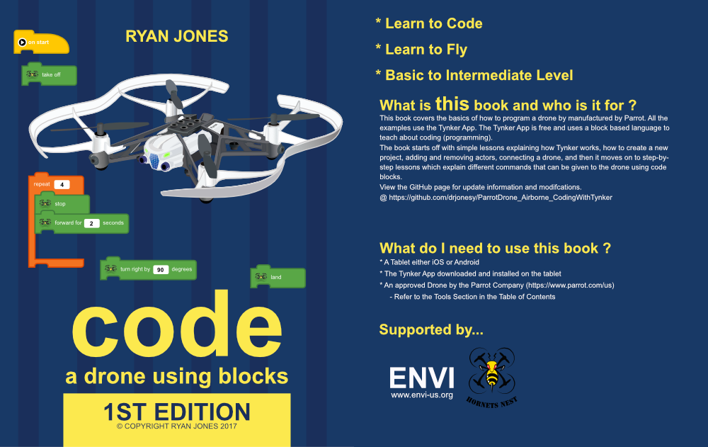

# Parrot Drone Airborne - Coding with Tynker App

This is a beginner course for learning how to program the Parrot Airborne Drone with the Tynker App Blocks.

### Book Options
- [Print Edition available on Amazon.com](https://www.amazon.com/Drone-Using-Blocks-step-step/dp/1973109425/ref=sr_1_1?ie=UTF8&qid=1510168157&sr=8-1&keywords=code+a+drone+using+blocks)
- [PDF / Digital Edition](Code-A-Drone-Using-Blocks.pdf) 
- [Online Wiki Edition](/drjonesy/ParrotDrone_Airborne_CodingWithTynker/wiki)

### Acknowledgments

I want to thank the following people for introducing me to aerial drones and development into unmanned systems. To Dr. James Burns for introducing ENVI (the Electric and Networked Vehicle Institute) to those of us attending Coleman University back in May 2015. To Rod Weiss for introducing me to Dr. Burns and Dr. Burn's vision of electric vehicle development and unmanned systems. To Robert Gubala who introduced me to quad-copter development and drone flying. Because of Robert I kept on the path of slowly learning more and more about drone development until it lead me into the tools I will be covering in this book's lessons. To Dan Wolfson who introduced me to the Robolink CoDrone which gave me the desire to find a more simplified solution for non-coders to learn how to control a drone with a code-like environment. To Norma Carter, my Aunt, who was willing to run a test of this course for her 4th and 5th grade parent orientation night in the Poway, CA school district. To Charlie Morgan for effectively teaching me how to program. Finally, to Mike Lebo for his unquenchable thirst for learning drones and desire to show that even an old dog can learn new tricks.

### © Copyrighted ™ Trademarked Material

All product names, logos, and brands are property of their respective owners. All company, product and service names used in this publication are for identification purposes only. Use of these names, logos, and brands does not imply endorsement.

