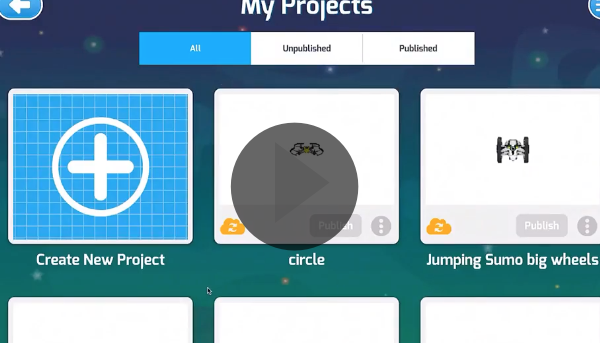
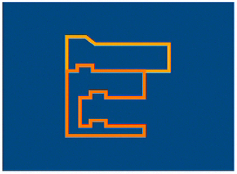

[HOME](https://github.com/drjonesy/ParrotDrone_Airborne_CodingWithTynker) [>>](02-how-to-remove-an-actor.md)
# How to Create a New Project

## Watch on YouTube

## or Read...
1) Remove the actor

2) Click on the **Trashcan**

3) Confirm the **Removal** by clicking **Yes**

4) Select **Blank Template**

