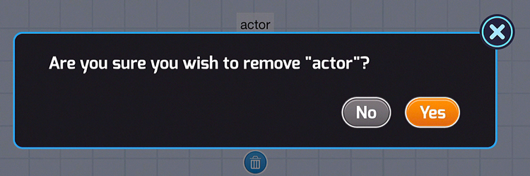

[<<](01-how-to-create-a-new-project.md)  [HOME](https://github.com/drjonesy/ParrotDrone_Airborne_CodingWithTynker) [>>](03-how-to-add-a-drone-robot.md)
# How to Remove an Actor
1) Remove the actor

2) Click on the **Trashcan**

3) Confirm the **Removal** by clicking **Yes**

