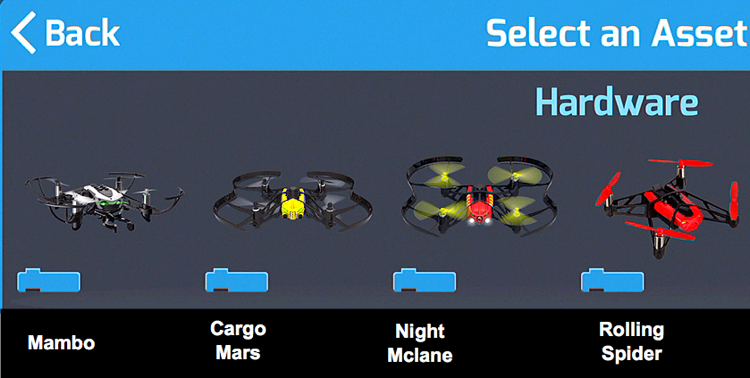
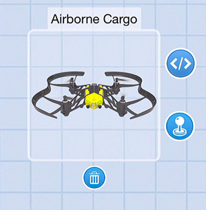

[<<](02-how-to-remove-an-actor.md)  [HOME](https://github.com/drjonesy/ParrotDrone_Airborne_CodingWithTynker)
# How to add a Drone/Robot

1) In the top right click the **plus button**

2) Select your drone type:

3) In this example, I’m using the **Airborne Cargo**

