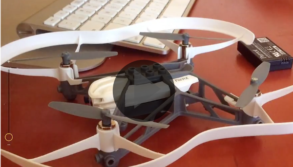
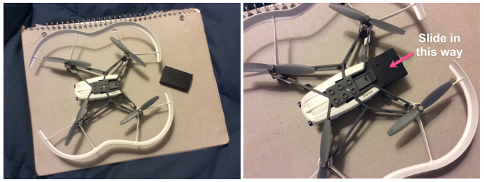
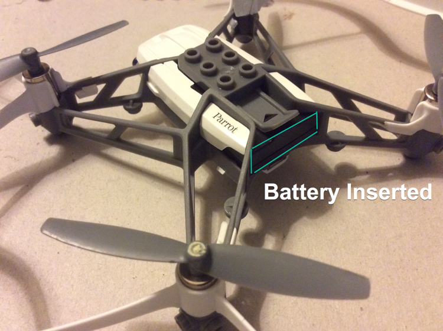
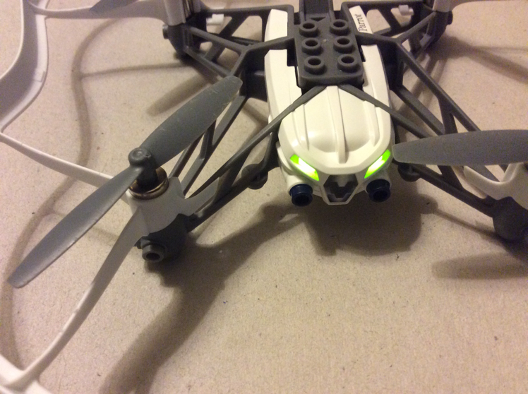
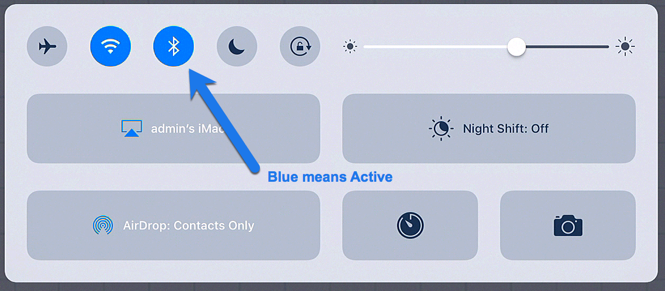
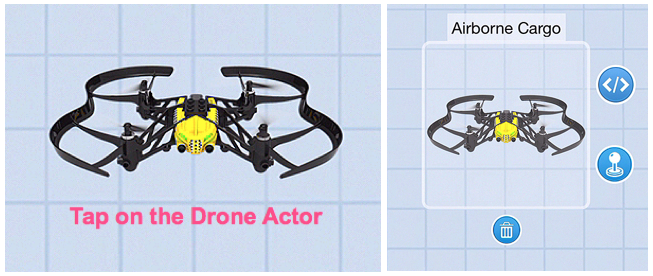
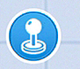
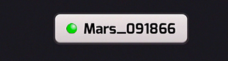

[<<](03-how-to-add-a-drone-robot.md)  [HOME](https://github.com/drjonesy/ParrotDrone_Airborne_CodingWithTynker) [>>](05-required-for-all-new-drone-projects.md)
# How to connect the Drone to Bluetooth

## Watch

## Read

1) Make sure the Drone has battery inserted.

2) Make sure the Drone is on.

3) Make sure your Bluetooth is enabled on your device.

4) Tap on your Drone Actor to make Active

5) Click on the **Joystick**

6) If your drone is connected you will see something like this…

7) If it is not, then it is likely searching for the drone. Wait till it connects. 

8) If it is connected, click the **X** in the top right to close this window.

9) You are connected!
