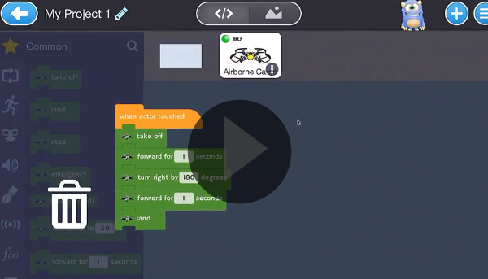
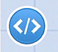
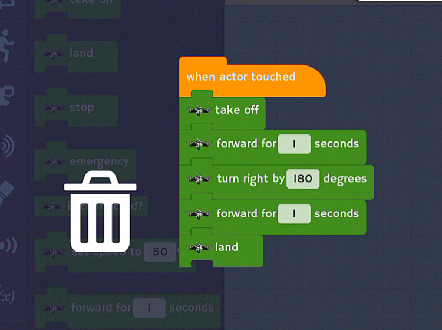

[<<](04-how-connect-the-drone-to-bluetooth.md)  [HOME](https://github.com/drjonesy/ParrotDrone_Airborne_CodingWithTynker) [>>](06-lesson-1-testing-the-drone.md)
# Required for All New Drone Projects 

## Watch

## Read

> Before we can add our own code, we must remove the current placeholder code.

Click on the **Code Button**

Take your finger, press it down on the **when actor touched** block and drag it over to the right. You should see a trashcan appear.

