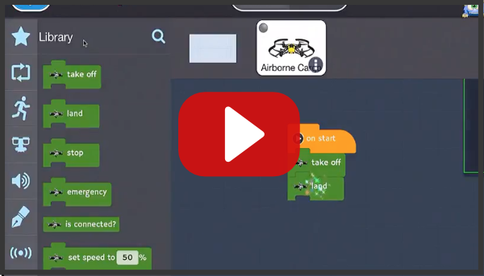
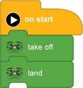

[<<](05-required-for-all-new-drone-projects.md)  [HOME](https://github.com/drjonesy/ParrotDrone_Airborne_CodingWithTynker) [>>](07-lesson-2-block-help.md)
# Lesson 1: Testing the Drone

## Watch on YouTube

## or Read...

> Before we get into all the fun stuff let’s make sure the drone will accept our block code.

Either in the Common blocks  or Loop blocks 

Add **on start** block

Then attach the **take off** from either the 

Common blocks  or Library blocks 

Next add the **Land** from either the 

Common blocks  or Library blocks 

And press the **Play Button**

