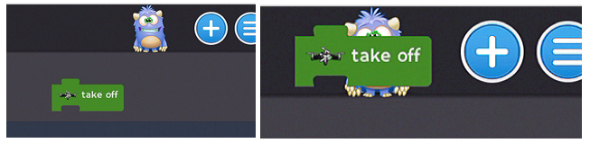
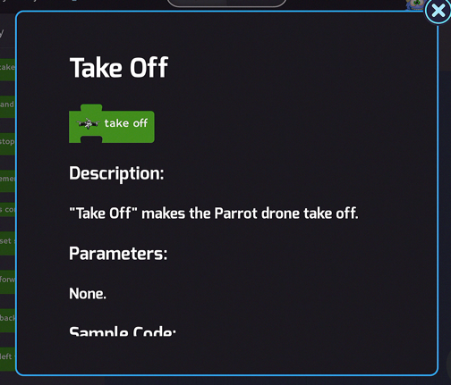

[<<](06-lesson-1-testing-the-drone.md)  [HOME](https://github.com/drjonesy/ParrotDrone_Airborne_CodingWithTynker)[>>](08-lesson-3-flying-forward.md)

# Lesson 2: Block Help

> In the future, you when you are building your own block programs you will want to know what a block does. To find this out find the little Monster in the top right of the screen. He is to the left of the plus button.

Take any block on the stage or in a block menu and drag it onto this monster. 

When you release a popup will appear that tells you all about the block. Scroll through this popup to read all about the block

