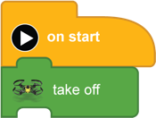
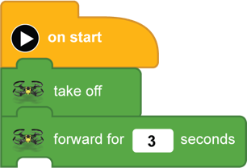
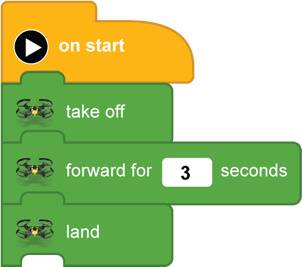

[<<](07-lesson-2-block-help.md)  [HOME](https://github.com/drjonesy/ParrotDrone_Airborne_CodingWithTynker)
# Lesson 1: Testing the Drone

> In most of the lessons the first thing we will do is add an **on start** and **take off** blocks. We will also likely finish off with a **land** and request that you **press the play button**.

select either the Common blocks  or Library blocks 

Add a **forward for [  1  ] seconds** and change the **1** to a **3**

Finish up by adding a land

And press the **Play Button**
