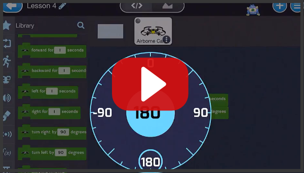
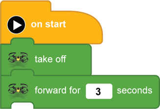
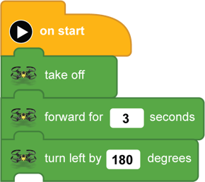
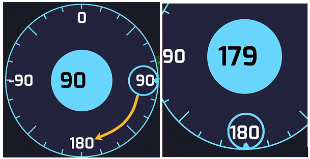
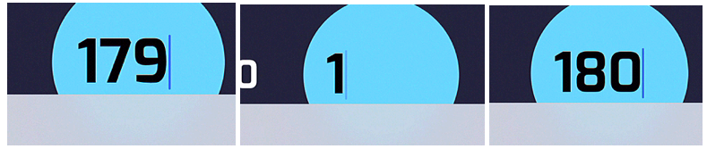
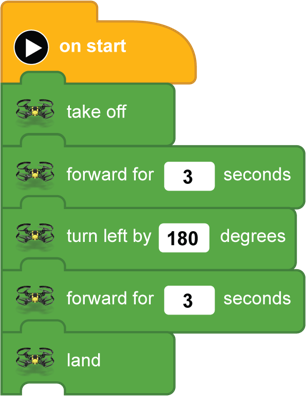

[<<](08-lesson-3-flying-forward.md)  [HOME](https://github.com/drjonesy/ParrotDrone_Airborne_CodingWithTynker) [>>](10-lesson-5-slide-left-slide-right.md)
# Lesson 4: Fly forward, turn around, come back, and land

## Watch on YouTube

## or Read...

> Just like Lesson 3 we will **take off**, fly **forward for [ 3 ] seconds**. But instead of **landing**, we will turn around **(180 degrees)** fly **forward for [ 3 ] seconds**. Then **Land**. 

Next snap either a **turn left by [ 180] degrees**
or a **turn right by [ 180 ] degrees**

If you can’t get it exactly on 180 degrees then click on the number in the center.

Finish it up with a **forward for [ 3 ] seconds** and a land

And press the **Play Button**
