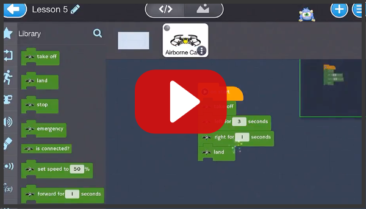
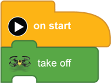
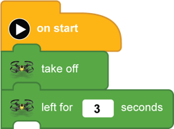
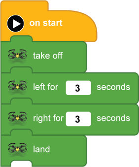

[<<](09-lesson-4-fly-forward-turn-arond-come-back.md)  [HOME](https://github.com/drjonesy/ParrotDrone_Airborne_CodingWithTynker)[>>](11-lesson-6-a-square.md)
# Lesson 5: Slide to left, slide to right

## Watch on YouTube

## or Read...

> The title says slide, but what we are doing is like a side step to the left. We are not turning just moving to the left and then to the right.

 
Add a **left for [ 3 ] seconds**

Add a **right for [ 3 ] seconds** and a **land**

And press the **Play Button**
