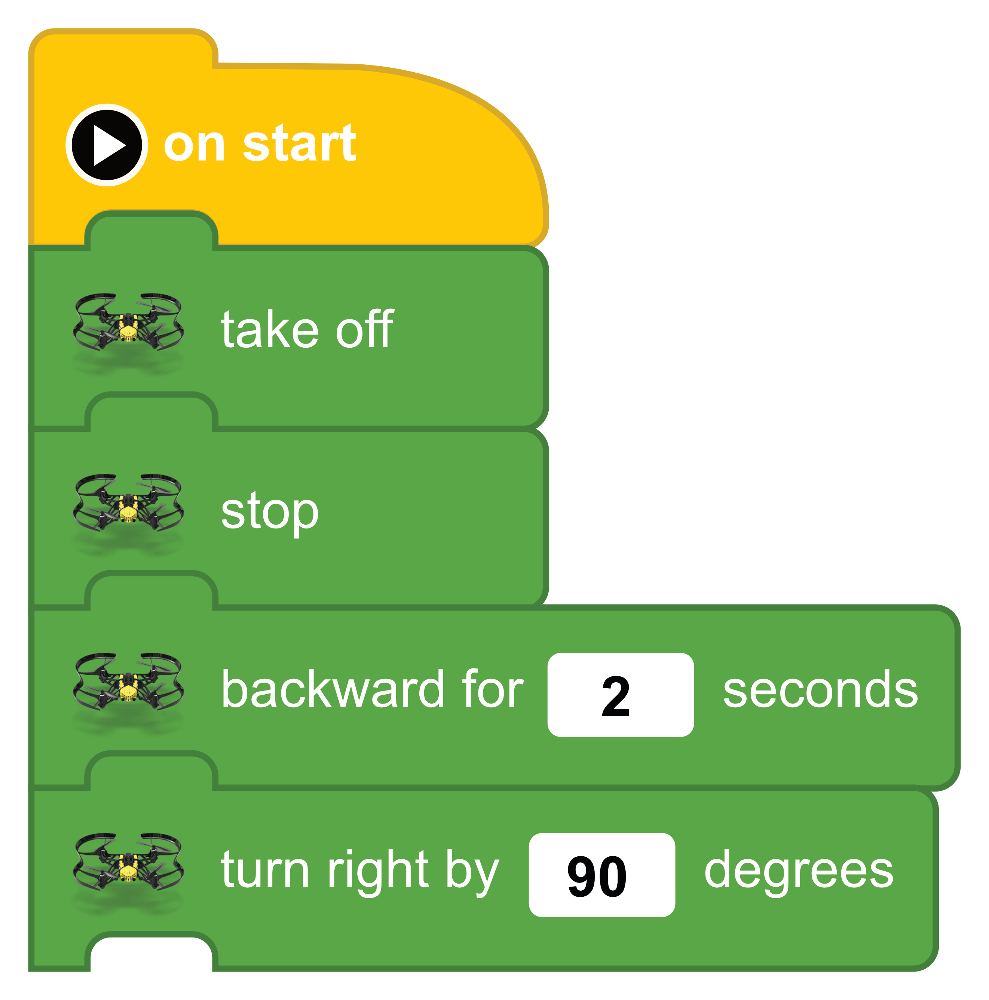
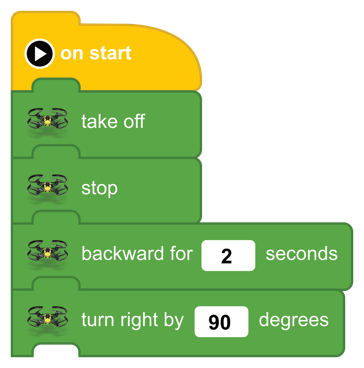
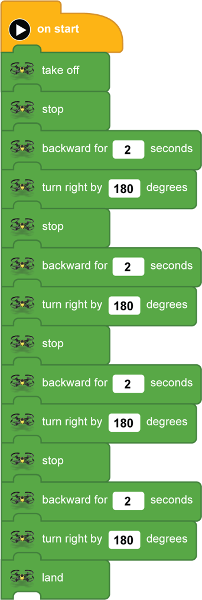

[<<](10-lesson-5-slide-left-slide-right.md)  [HOME](https://github.com/drjonesy/ParrotDrone_Airborne_CodingWithTynker) [>>](12-lesson-7-a-square-repeat-block.md)
# Lesson 6: A Square

> We are going to make the drone fly in a square backwards.Just like all other lessons. We need to take off first. 

We will add two new blocks. **Backward for [ 1 ] seconds** and **stop**

#### Stop: What is it?
Think of stop like a pause button. If I am flying forward and I add a **stop** block. The Drone will stop and hover in place. It helps stabilize the drone before doing the next command.

Add a **stop** block

Add two more blocks:  
**backward for [ 2 ] seconds** and **turn right by [ 180 ] degrees**

Next add 3 more copies of the stop, backward, and turn right blocks for a total of 4 times fly in box.

And finish it off with a **land**

And press the **Play Button**
