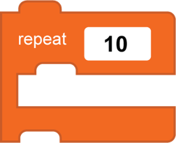
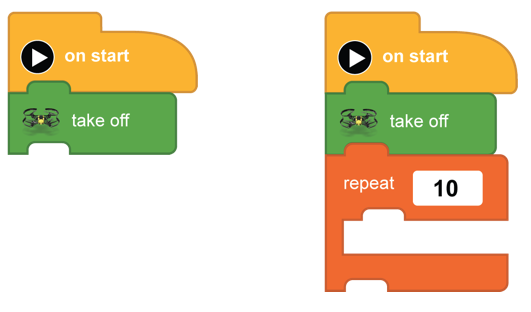
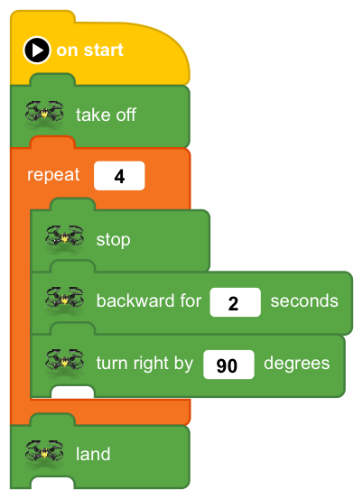

[<<](11-lesson-6-a-square.md)  [HOME](https://github.com/drjonesy/ParrotDrone_Airborne_CodingWithTynker) [>>](13-lesson-8-fly-in-a-circle.md)
# Lesson 7: A Square (Repeat Block)

> Did lesson 6 feel like we added to many blocks. Did if feel as if there should have been an easier and better way to add copies. Well, there is a better way. It is the **repeat** block.
 
The **repeat** block lets us repeat selected blocks over and over as many times as we want.

The **repeat block** can be found in the loop menu 

Scroll down till you find this block.

On a New Project: Add a **take off** and Attach a **repeat** under it.

In between the **repeat** block place the blocks we duplicated in Lesson 6. 

Change the **repeat** block number to **4** and add a **land** block below the **repeat** block

Using the **repeat** block lets us shrink the amount of code blocks we need on screen while still doing the same action.

And press the **Play Button**
