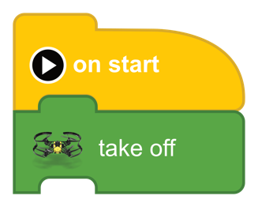
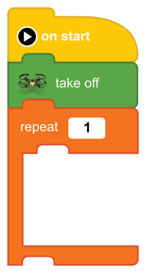
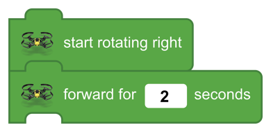
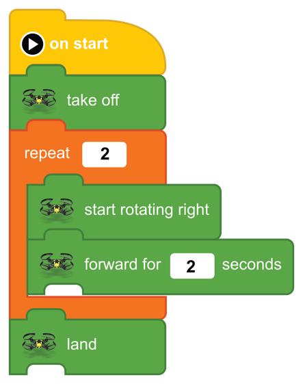

[<<](12-lesson-7-a-square-repeat-block.md)  [HOME](https://github.com/drjonesy/ParrotDrone_Airborne_CodingWithTynker) [>>](14-lesson-9-variables.md)
# Lesson 8: Fly in Circle

> Ok. We’ve learned to fly in Square. But how do we fly in circle? We need to somehow keep moving while rotating and leaning in towards the same direction. Plus, we need to fly in either forward or backwards to create a circle; otherwise, we will just be turn in the same place…?

### Challenge 1

At this point, you are encouraged to try and solve this challenge on your own. If it seems too difficult then continue with the lesson.

**Hint:** Drag Blocks onto the little monster in the top-right corner

## How to:
Like each step, we need an on start and take off.

Just like the square, we need a repeat block. Add a repeat block under the take off. For now just use [ 1 ]

Next, we need to make the drone fly forward and turn at the same time. I’m going to *turn right* for this example.

In the Library: find these two blocks and place them between the repeat block.

Just as the name says, the Drone will **start rotating right**
The size of the circle is based on the number between the forward block.

Test out the code. Depending on your environment you may need to change the repeat from 1 to 2, 3, or 4.

Add a land block.

And press the **Play Button**
