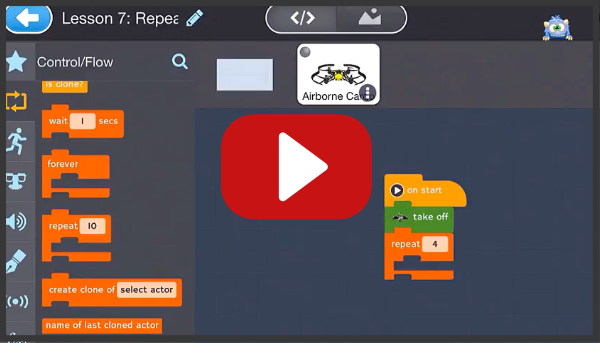
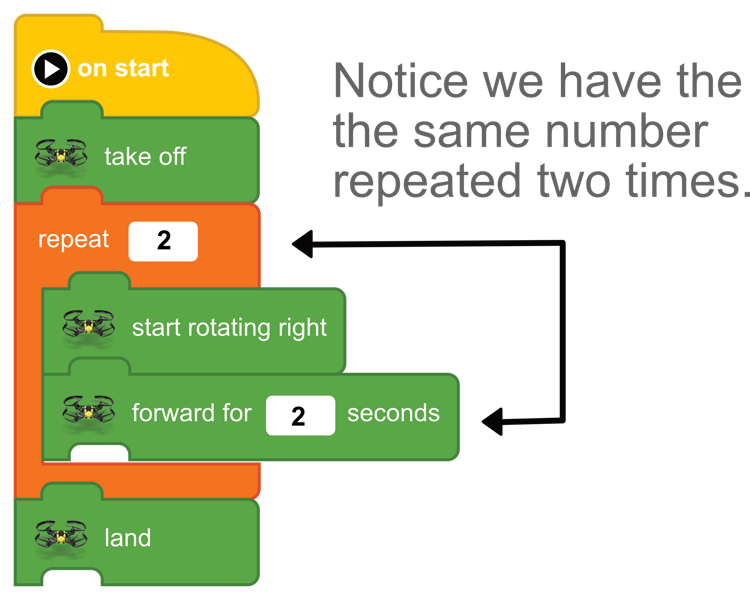
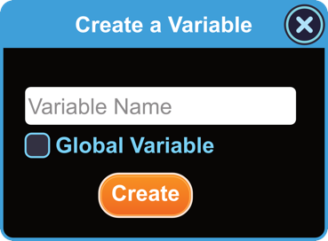
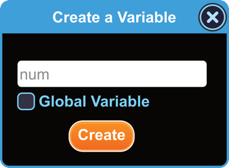
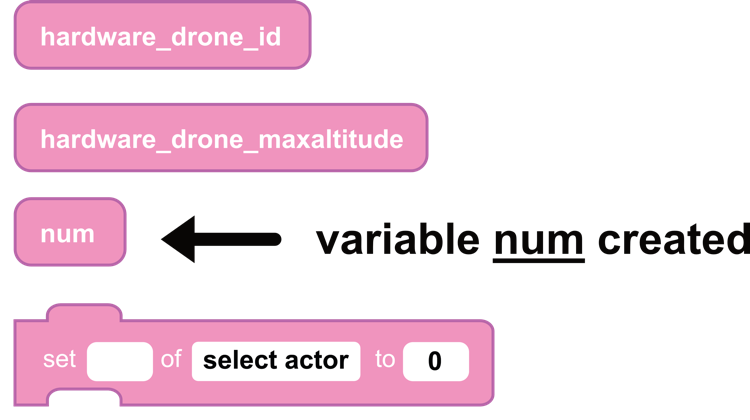
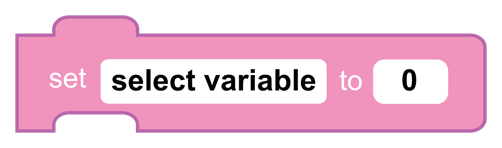
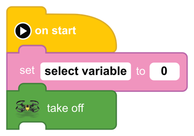
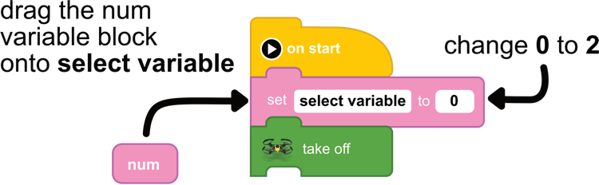
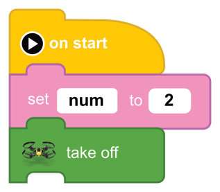
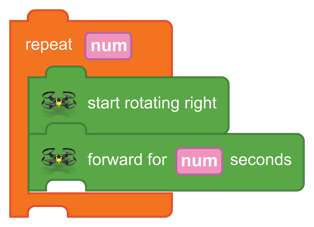

[<<](13-lesson-8-fly-in-a-circle.md)  [HOME](https://github.com/drjonesy/ParrotDrone_Airborne_CodingWithTynker) 
# Lesson 9: Variables

## Watch on YouTube

## or Read...

### What is a variable? 
> A variable is a block that contains a value. For now, we are just going to be using variables to hold numbers.

In our last lesson, we made the Drone fly in a Circle. 

Let’s look at the code.

Could you imagine if we had it 10 times or more. We would have type in the same number over and over. If we wanted to change that number just by one, we would have to do it again and again. That’s too much work.

An easier way is make a variable and have it equal the number 2.

In the Navigation on the left find the *Functions Menu*

In the function menu create a **New Variable**

When you click the button a pop-up will open. 

Give the variable the name (num). *Uncheck Global Variable* if it is checked.

Your new variable block **num** has been created. It can be found in the function menu between **hardware_drone_maxaltitute** and **set __ of select actor to 0**

Next, find the block that looks like the following…

Attach this block between on **start** and **take off**

Drag a copy of the **num** variable onto **select variable** and change the two value to **2**

Last step, drag a copy of the **num** over the **repeat** number replacing the number value. Drag a second copy over the number **2** on the **forward for 2 seconds’** block.

The code completed. 

And press the **Play Button**

> After you run the code. Try changing the **num** value from 2 to 4.5 or something else to see the effects.

